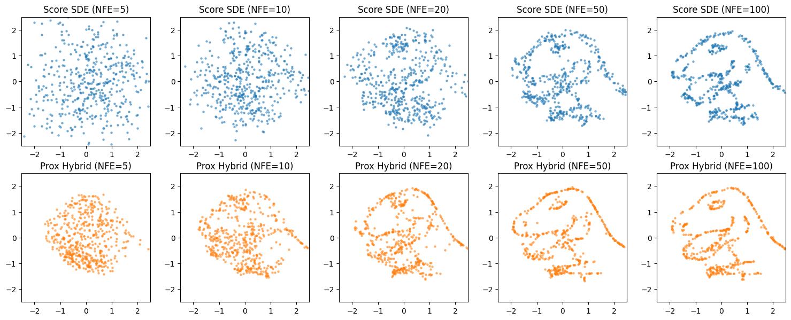
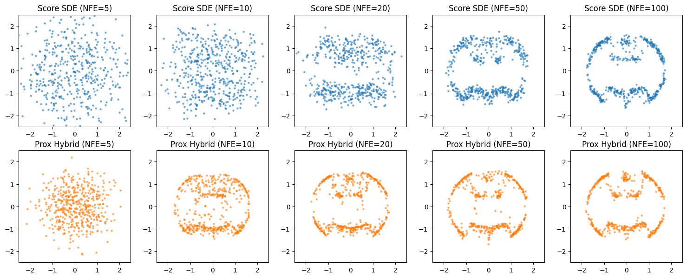

Proximal Diffusion Models (ProxDM) in PyTorch

1. Overview

This repository provides a from-scratch PyTorch implementation of Proximal Diffusion Models (ProxDM). Applied to low-dimensional datasets (2D point clouds) and MNIST, this project explores a highly efficient alternative to standard Score-Based generative models by drastically reducing the required number of sampling steps.

This work was developed as part of the Optimization for Computer Vision course at CentraleSupélec (M2 Math & AI).

2. Reference

The theory and implementation are directly based on:

"Beyond Scores: Proximal Diffusion Models" (Zhenghan Fang, Mateo Díaz, Sam Buchanan, Jeremias Sulam - arXiv:2507.08956, 2025).

3. The Core Concept: Score-Based vs. ProxDM

The fundamental contribution of this paper lies in how the reverse-time Stochastic Differential Equation (SDE) is discretized.

Standard Score-Based Models (Forward Discretization):
Traditional models estimate the score $\nabla_x \log p_t(x)$ using a neural network and solve the reverse SDE via an explicit (forward) discretization (e.g., Euler-Maruyama). This method suffers from numerical instability, forcing the use of extremely small step sizes and resulting in a very high Number of Function Evaluations (NFE).

ProxDM (Backward Discretization):
This approach replaces the standard score estimation with a proximal operator, effectively applying an implicit (backward) discretization to the reverse SDE. The network learns to approximate the proximal operator of the log-density:

$$\hat{x} = \text{prox}_{\lambda h}(x_t)$$

Why it matters: The proximal formulation inherently stabilizes the reverse updates. It allows for significantly larger step sizes, drastically reducing the required sampling steps — bounded theoretically by $\tilde{\mathcal{O}}(d/\sqrt{\epsilon})$ — while maintaining high generation quality, precision, and recall.

4. Repository Highlights

Training Dynamics: Comparison between classical Score Matching loss and Proximal loss on the MNIST dataset.

Generative Quality (Low-Dim): Visualizations of diffusion trajectories mapping complex 2D distributions ("Dino" and "Batman").

Performance: Full training and sampling pipeline tested on an RTX 5090.